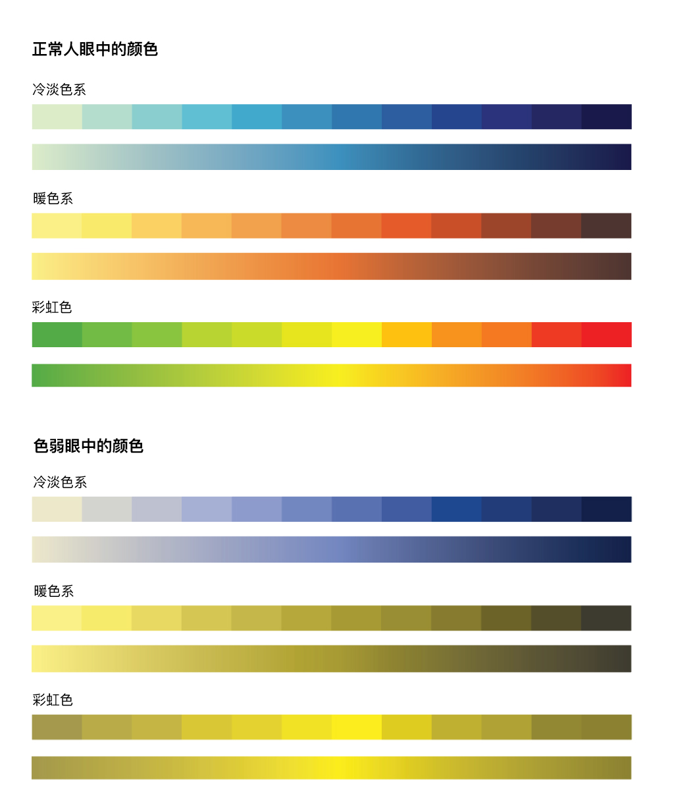

# Coronavirus-2019-demo

本次分享主要分为2个部分，
* 简要介绍项目背景，图层以及数据意义
* 四个图层核心代码简述
分享中的代码难度不高，适合初中级前端程序员以及对Mapbox,Gis可视化感兴趣的同学。

相关文章： [从地图看疫情](https://www.zhuwenlong.com/blog/article/5e5235cd502a71323370c652)

## 1. 项目介绍

* 项目地址：https://www.mapbox.cn/coronavirusmap
* 主要控件：`数字面板`，`曲线图`，`语言切换`, `时间数据控件`, `四个主要图层`
* 数据解释

## 2. 各图层教程

### 2.1 热力图

要点: `热力图的绘制原理`，Mapbox官方热力图图层的实现以及`热力参数调优`，`热力图配色`。

#### 参考资源：
* 热力图绘制原理 https://cdn.zhuwenlong.com/demos/heatmap.html
* Mapbox热力图图层官方文档 https://docs.mapbox.com/mapbox-gl-js/style-spec/layers/#heatmap
* 调优前的热力图图层 https://zmofei.github.io/coronavirus-2019-demo/src/heatmap/heatmap-origin.html
* 调优后的热力图图层  https://zmofei.github.io/coronavirus-2019-demo/src/heatmap/heatmap-optimized.html

### 2.2 填色图

要点：Mapbox中实现填色图层，`Mapbox Expressoion` 的使用

### 2.3 聚合图

要点：Mapbox数据的聚合功能, `cluster: true`
* 调优前的热力图图层 https://zmofei.github.io/coronavirus-2019-demo/src/colorfill/colorfill-origin.html
* 调优后的热力图图层  https://zmofei.github.io/coronavirus-2019-demo/src/colorfill/colorfill-optimized.html
* Mapbox Geojson Source https://docs.mapbox.com/mapbox-gl-js/style-spec/sources/#geojson
* Mapbox 官方集合图层DEMO https://docs.mapbox.com/mapbox-gl-js/example/cluster/

### 2.4 分类聚合

要点：Mapbox自定义复杂SVG图标，

Mapbox自定义图层

## 3. Q&A